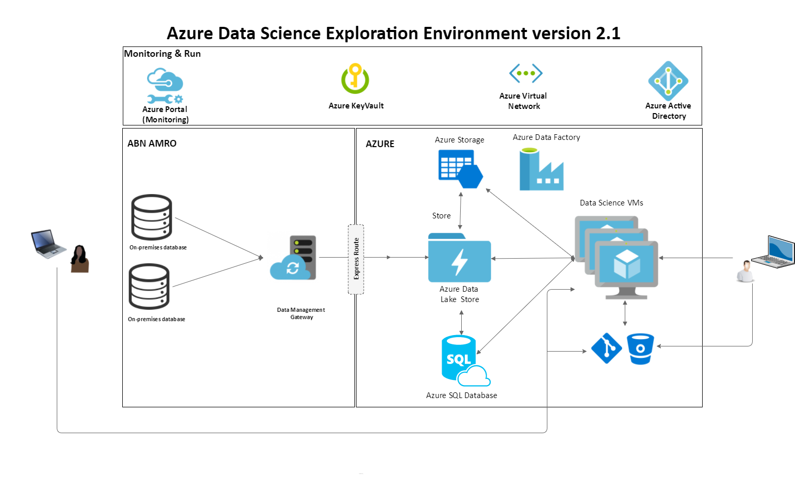

# Course Introduction

Introduction to Azure Data Science Exploration Environment (DSEE) is designed to help data scientists, data analysts, quantitative modelers learn to 
configure the DSEE, connect to the DSEE, read and write data between the different storage components of the DSEE and your version-control system (VCS). This course takes a use-case-based approach by walking through a knowledge discovery and data mining example using Python.

# Pre-requisites

The course has no specific prerequisites. The only prerequisite is that you are considering to use DSEE for your data exploration and model building and and later productionazing the insights from the exploration phase in an Azure DTAP environment.

# Learning objective

After completing this one day course, participants will be able to:

1. Understand why it is is not straightforward to introduce the cloud in a company like AAB       

2. Understand how to use the current components of the DSEE including guidelines for collaboration and structuring data science projects

3. Understand the process of importing production data to the DSEE

4. Understand the production process (L2P)    

Please let us know how we can improve our content.

Created by a Microsoft Employee.

Created by the MAAP teams.